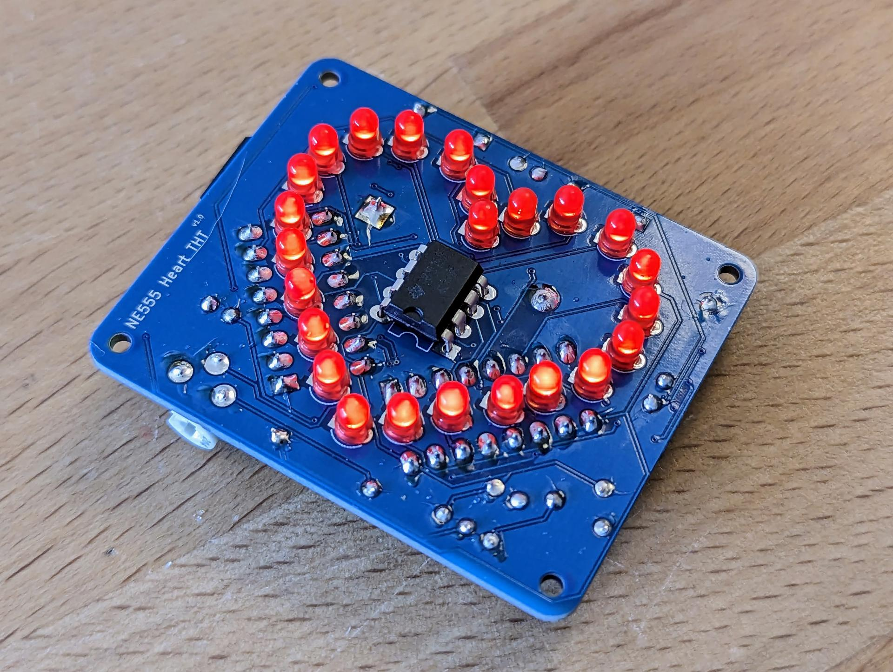
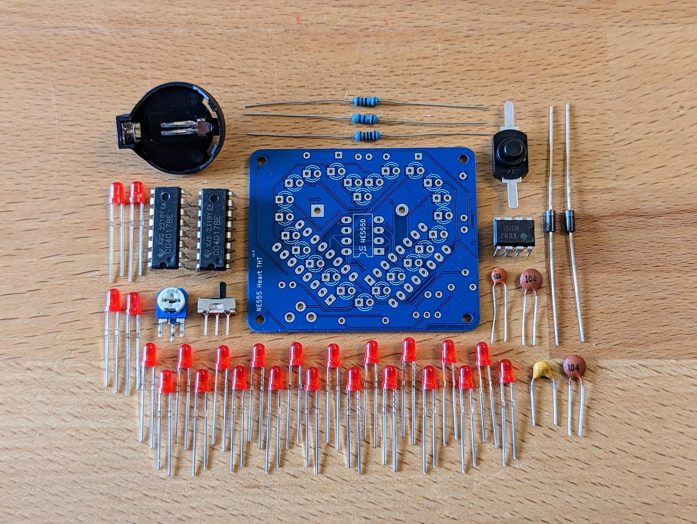

# Heart NE555 THT-Version
24 LEDs forming a LED-Heart driven by a NE555 bistable vibrator. A LED-Light runs around the heart. The speed of the running LED-light can be modified by changeing some resistors.

 

- Status: **Complete**
- Difficulty: **3/5**

## Where to Buy?
You can purchase the Heart NE555 in our online store:

➡️ [Buy the Smartphone Robot Kit Here](https://shop.blinkyparts.com/de/Herz-THT-Ein-besonderes-Herz-mit-einem-ganz-besonderen-Chip/blink237642)

### Parts List

| Description                   |  Name  | Quantity |
|-------------------------------|:------:|:--------:|
| LED 3mm red	                | D3-D26 |    24    |
| Capacitor 10nF            	|   C1   |     1    |
| Capacitor 100n            	|  C3-C5 |     2    |
| Capacitor 1uF			|   C2	 |     1    |
| Diode 1N4007              	|  D1-D2 |     2    |
| Push Button               	|   SW1  |     1    |
| Resistor 1k          		|   R1   |     1    |
| Resistor 100k        		|   R2   |     1    |
| Resistor 47R         		|   R3   |     1    |
| Resistor Variable   		|   RV1  |     1    |
| Switch	   		|   SW2  |     1    |
| Push Button	   		|   SW1  |     1    |
| NE555                  	|   U1   |     1    |
| CD4017                 	|  U2-U3 |     2    |
| CR2032 Battery Holder (THT)   |  BT1   |     1    |
| CR2032 Battery (not included) |        |     1    |

### Manual
You can find the manual and pictures of every step here: https://github.com/Binary-Kitchen/SolderingTutorial

### Copyright and Authorship

- Board: [CC-BY-NC-SA 4.0](https://creativecommons.org/licenses/by-sa/4.0/) - [Timo Schindler](https://shop.blinkyparts.com), Thomas Schmid
- CR2032 battery holder footprint: [CC-BY 4.0](https://creativecommons.org/licenses/by/4.0/) - Sparkfun (https://github.com/sparkfun/SparkFun-KiCad-Libraries)
